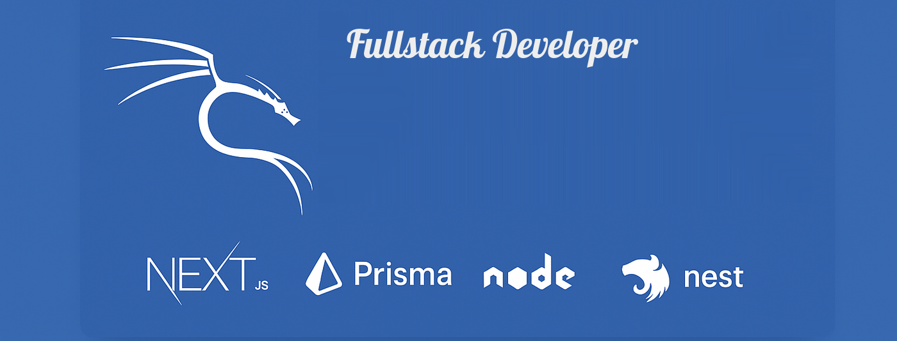

  

###

<h2 align="left">Hi 👋! My name is Riyajul Islam Akash and I'm a  Fullstack Developer from Bangladesh</h2>

## 👨‍💻 About Me  

I'm a Full Stack Developer from Bangladesh, dedicated to crafting AI-driven, scalable, and user-centric web applications. I focus on delivering high-performance digital solutions by combining strong problem-solving skills with modern development practices.

I’m passionate about transforming ideas into intelligent, intuitive, and reliable products — from sleek, responsive front-end experiences to robust, cloud-ready back-end systems.

With a continuous learning mindset, I explore emerging technologies like AI integrations, automation, and DevOps workflows to build smarter and more efficient software.

✨ **Current Focus:**  
- Building full-stack applications with **Next.js + Node.js**  
- Exploring **Nest.js** and **TypeScript best practices**  
- Strengthening my skills in **DevOps** and **cloud deployment**  

---

## Tech Stack

  
  
  
  
  
  

## Styling

## Tools

## Cloud & DevOps Services

###

  
  
  
  

###

  
  
      
   
  

###

  

###

###

<picture>
  <source media="(prefers-color-scheme: dark)" srcset="https://raw.githubusercontent.com/mdabdulkyum1/mdabdulkyum1/main/github-snake-dark.svg" />
  <source media="(prefers-color-scheme: light)" srcset="https://raw.githubusercontent.com/mdabdulkyum1/mdabdulkyum1/main/github-snake.svg" />
  
</picture>

###

